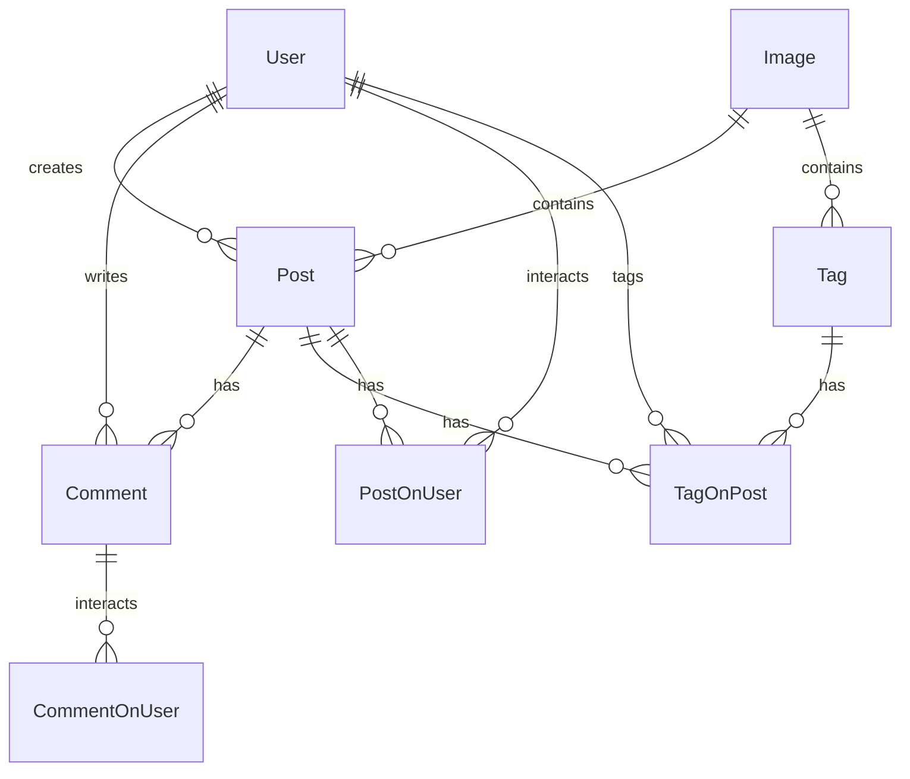

# Database design

```mermaid
erDiagram
    Post ||--o{ Comment : has
    Post ||--o{ TagOnPost : has
    Post ||--o{ PostOnUser : has
    User ||--o{ Post : creates
    User ||--o{ Comment : writes
    User ||--o{ PostOnUser : interacts
    User ||--o{ TagOnPost : tags
    Comment ||--o{ CommentOnUser : interacts
    Tag ||--o{ TagOnPost : has
    Image ||--o{ Post : contains
    Image ||--o{ Tag : contains
```
